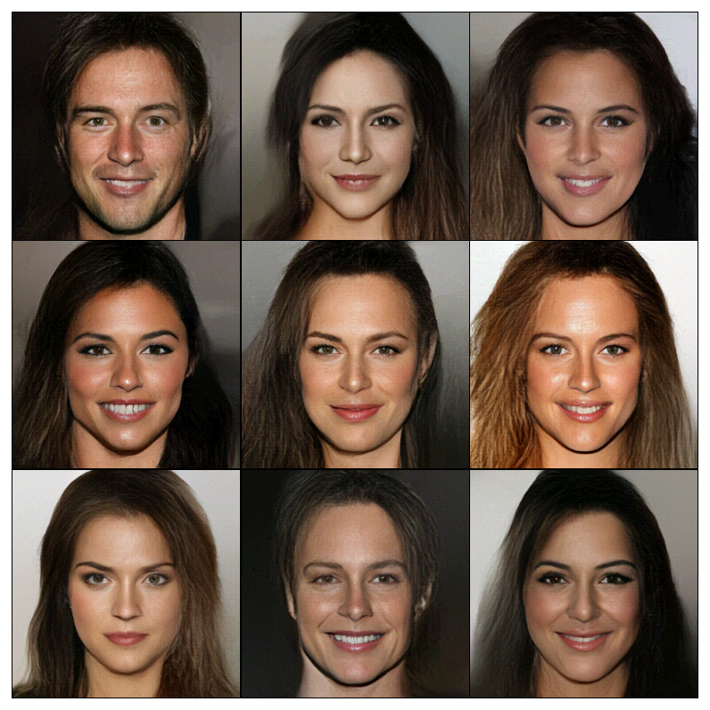

# MaCow: Masked Convolutional Generative Flow

Code for reproducing results in the paper
>[MaCow: Masked Convolutional Generative Flow](https://arxiv.org/abs/1902.04208)



## Requirements
The code was tested with `python 3.6`, `pytorch 0.4.1`, and `torchvision 0.2.1`.

Run
```
pip install -r requirements.txt
```

## Running the experiments
First go to the experiments directory:
```
cd experiments
```

### CelebA-HQ 256x256
#### Uniform Dequantization
```bash
python -u celeba.py --config configs/celebA256-conv.json --batch-size 40 --batch-steps 10 --image-size 256 --n_bits 5 --dequant uniform --data_path '<data_path>' --model_path '<model_path>'
```
#### Variational Dequantization
```bash
python -u celeba.py --config configs/celebA256-vdq.json --batch-size 40 --batch-steps 10 --image-size 256 --n_bits 5 --dequant variational --data_path '<data_path>' --model_path '<model_path>' --train_k 2
```

### LSUN 128x128
#### Uniform Dequantization
```bash
python -u lsun.py --config configs/lsun128-vdq.json --category [church_outdorr|tower|bedroom] --image-size 128 --batch-size 160 --batch-steps 16 --data_path '<data_path>' --model_path '<model_path>' --dequant uniform --n_bits 5
```
#### Variational Dequantization
```bash
python -u lsun.py --config configs/lsun128-vdq.json --category [church_outdorr|tower|bedroom] --image-size 128 --batch-size 160 --batch-steps 16 --data_path '<data_path>' --model_path '<model_path>' --dequant variational --n_bits 5 --train_k 3
```

Remeber to setup the paths for data and models with arguments `--data_path` and `--model_path`.
Sampled images after each epoch are stored in the directory: `<model_path>/images`. 

#### Note: accumulated gradients
The argument `--batch-steps` is used for accumulated gradients to trade speed for memory.
The size of each segment of data batch is `batch-size / (num_gpus * batch-steps)`
